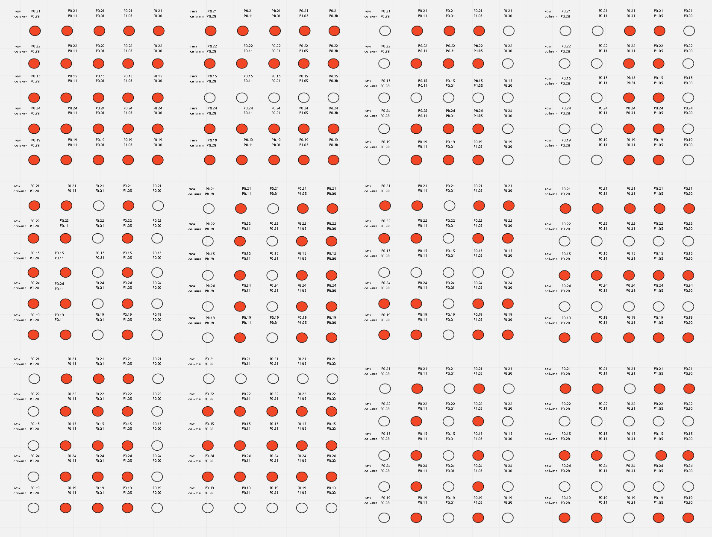

<!-- write your design document here -->

## Microbit LED Light-show ##

To create an engaging light-show, the microbit's built-in LEDs were used to display a sequence of 
patterns. My design involves using the LEDs to display some simple patterns at a high speed, based
on some conditions. The figure below shows the patterns used for this light show.

## How the design was implemented ##

#### The Boiler-plate code ####
The very first step was to create functions to set the direction and output of the GPIO pins to light
the LEDs. To do so, functions named `set_bit_[Base-address]_[offset]` were created, where `[Base-address]` 
is the base address of the port and `[offset]` is the offset from the base address to access either the 
DIR register or the OUT register. To make the LEDs appear to be blinking, a blink and delay function were 
implemented. After creating a pattern, the program calls the blink function, which continually decrements 
from a number, until it reaches 0. After the number hit 0, the blink function branches to 
`clear_bit_0x50000000_0x504` to clear the LEDs. This function then branches to a delay function, which 
delays the displaying of the next pattern for a short period of time so that the LEDs don't appear to be static.
After all this branching, to make sure the program returned back to continue the rest of the program, stacks 
were used to ensure the link register was saved and restored inside each function.

#### The design implementation ####
In the main function, everything is contained in a while loop. The loop starts with a large number stored in 
register 4 and in each iteration, that number gets decremented. When the number reaches 0, the program restarts 
from the beginning by branching to the main function. This is done to ensure the LEDs are always running in an 
infinite loop. The patterns are generated through the use of conditions such as if the number in register 4 is 
divisible by a certain number. To figure out if the number is divisible, the quotient is multiplied with the 
divisor and the result is subtracted from the dividend to get the remainder which is then compared to 0. 
If the remainder is 0, through the use of IT blocks, the program branches to the function that generate the pattern, 
by first calling the appropriate branch which then calls the corresponding function to set the direction and output 
of the GPIO pins. After the pattern is generated, the blink function is called to make the LEDs blink as described above.
The reason for using branches was so that using IT blocks, the program could branch to the appropriate function based 
on the conditions. Branching to the function directly using the IT block conditions was not possible as the IT block 
would not be able to branch to the function directly. Inside the while loop, there are 12 conditions which checks if the 
register 4 number is divisible by 1 - 12. Because the starting number in register 4 is initially 10,000, not all conditions 
will be met which would make the light show appear stationary for a while if the delay was set to be large. Which is why 
in the explanation of the blink and delay function earlier, it was mentioned that the delay is only for a short period of time.

#### Why the design was appropriate for the task ####

This design meets all the required criterias because the leds change over time to create a engaging light show and never stops. 
It works powered over any USB connection and uses memory.

### improvements that could be made ###
Main function contains a lot of repetitive code which could be more compact using branchtables to branch to certain cases that would light certain LEDS.
Design could be more complex through the implementation of a RNG.
Using sound effects to accompany the light show.

